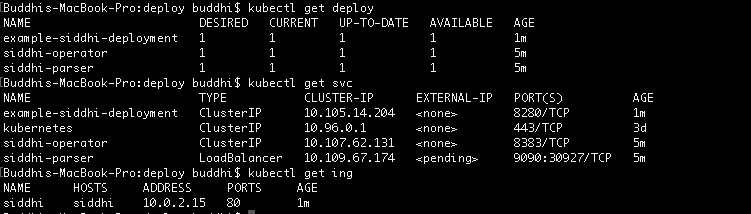
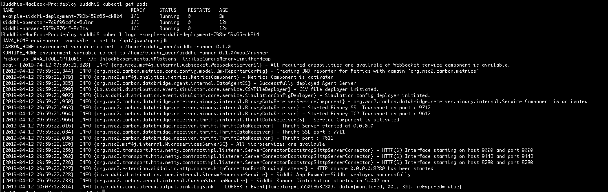

# Getting Started

Siddhi Operator allows you to run stream processing logic directly on a Kubernetes cluster.
To use it, you need to be connected to a cloud environment or to a local cluster created for development purposes.

## Configure Kubernetes Cluster
### Local Deployment
If you need help on how to create a local development environment based on *Minikube*,
   -  Refer: [Minikube Installation Guide](https://github.com/kubernetes/minikube#installation).

### Google Kubernetes Engine Cluster

Make sure you apply configuration settings for your GKE cluster before installing Siddhi Operator.
   -  Refer: [Configuring a Google Kubernetes Engine Cluster](docs/gke-setup.md)
   
## Enable the NGINX Ingress controller
The Siddhi Operator resource uses the NGINX Ingress Controller to expose the deployments to the external traffic.

In order to enable the NGINX Ingress controller in the desired cloud or on-premise environment,
please refer the official documentation, [NGINX Ingress Controller Installation Guide](https://kubernetes.github.io/ingress-nginx/deploy/).

Supported Version: nginx 0.22.0 

## Install Siddhi Operator in Kubernetes cluster

1. Clone Siddhi Operator Git repository.  
   `git clone https://github.com/siddhi-io/siddhi-operator.git`


2. Execute the following commands to setup the Siddhi Operator in the kubernetes cluster.
```
    kubectl create -f ./deploy/crds/siddhi_v1alpha1_siddhiprocess_crd.yaml
    kubectl create -f ./deploy/service_account.yaml
    kubectl create -f ./deploy/role.yaml
    kubectl create -f ./deploy/role_binding.yaml
    kubectl create -f ./deploy/operator.yaml
```
    
## Testing a sample

1. Execute the below command to create a sample siddhi deployment.  
`kubectl create -f ./deploy/crds/monitor-app.yaml`

   Siddhi Operator would create a Siddhi-Runner deployment with the Siddhi app deployed through the example-siddhi-app CRD, a service, and an ingress to expose the http endpoint which is in the Siddhi sample.
   
   

:information_source: Note:  The Siddhi Operator automatically creates an ingress and exposes the internal endpoints available in the 
Siddhi App by default.
In order to disable the automatic ingress creation, you can set **AUTO_INGRESS_CREATION** environment variable to false/null in
 the `./deploy/operator.yaml`

2. Obtain the external IP (EXTERNAL-IP) of the Ingress resources by listing down the Kubernetes Ingresses.
 
   `kubectl get ing`

3. Add the above host (`siddhi`) as an entry in /etc/hosts file.

4. Use following CURL command to publish an event to the sample Siddhi app that's deployed.
```
curl -X POST \
 http://siddhi/monitor-app/8280/example \
   -H 'Content-Type: application/json' \
   -d '{
        "type": "monitored",
 	     "deviceID": "001",
 	     "power": 39
       }`
   
```  
5. View the logs of the Siddhi Runner pod and observe the entry being printed by the Siddhi sample app accepting event through the `http` endpoint.
   

